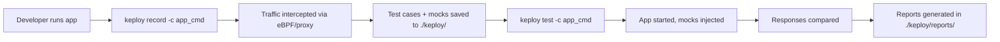
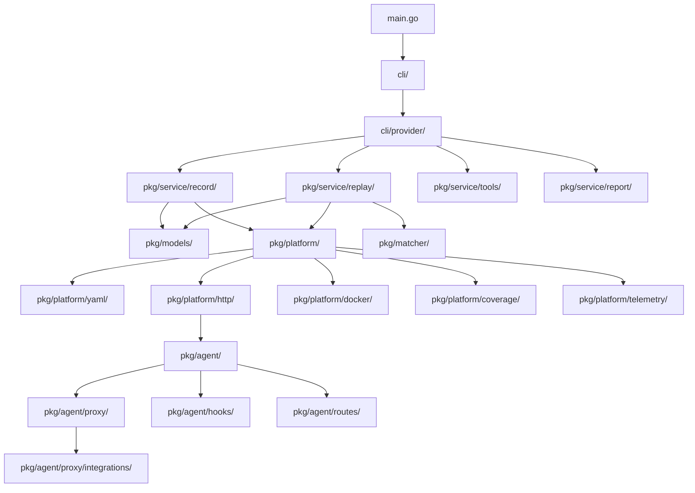

# Repository Analysis — Keploy (`go.keploy.io/server/v3`)

## Project Overview

### Purpose
Keploy is an open-source backend testing tool that **records** real API and dependency traffic from a running application and **replays** it as deterministic tests with mocks. It intercepts traffic at the network layer using eBPF (Linux) and a userspace proxy (macOS/Windows), so applications require no SDK or code changes.

### Core Functionality
1. **Record Mode** — Captures HTTP/gRPC requests + outgoing dependency calls (Postgres, MySQL, MongoDB, Redis, DNS, generic TCP) into YAML/JSON test-sets with mocks
2. **Replay/Test Mode** — Replays recorded traffic against the application, mocking all outgoing dependencies deterministically, then compares responses
3. **Contract Testing** — OpenAPI schema generation and consumer/provider validation
4. **Normalize/Sanitize** — Accepts changes in test golden files; scrubs secrets from recorded data
5. **Coverage** — Integrates with Go, Python, JavaScript, and Java coverage tools

### Business Objective
Eliminate the need for manual test writing by auto-generating regression tests from real traffic, achieving high code coverage with zero developer effort.

### User Flow


### Major Features
- Multi-protocol support: HTTP, gRPC, PostgreSQL, MySQL, MongoDB, Redis, DNS, Generic TCP
- Cross-language coverage: Go, Python, JavaScript, Java
- Docker & Docker Compose native support
- Test-mock mapping for deterministic replay
- Flaky test detection and auto-removal (`--must-pass`)
- Template-based dynamic value substitution
- Secret sanitization via Gitleaks rules
- GitHub Actions integration
- Self-update mechanism

---

## Architecture Analysis

### Folder Structure
```
keploy/
├── main.go                    # Entry point → cli.Root()
├── cli/                       # CLI command definitions (cobra)
│   ├── root.go                # Root command setup
│   ├── record.go, test.go     # Subcommand registration
│   └── provider/              # Config processing, validation, service wiring
│       ├── cmd.go             # Flag definitions, config validation (1603 lines)
│       ├── core_service.go    # DI container — wires services + platform impls
│       └── service.go         # Service provider interface
├── config/                    # Configuration structures
│   ├── config.go              # Config struct definitions
│   └── default.go             # Default YAML config template
├── pkg/
│   ├── service/               # Business logic layer
│   │   ├── record/            # Record service (captures traffic)
│   │   ├── replay/            # Replay service (runs tests) — 3770 lines
│   │   ├── report/            # Report generation
│   │   ├── tools/             # Normalize, sanitize, templatize
│   │   ├── contract/          # Contract testing
│   │   ├── runner/            # Test orchestration
│   │   └── mock/              # Mock management
│   ├── models/                # Domain models (44 files)
│   │   ├── mock.go            # Mock model (43K)
│   │   ├── http.go            # HTTP models
│   │   ├── postgres_v3_cell.go # PostgreSQL wire protocol (115K!)
│   │   └── errors.go          # Error types
│   ├── matcher/               # Response comparison logic
│   │   ├── utils.go           # JSON diff, noise handling (51K)
│   │   ├── http/              # HTTP-specific matching
│   │   └── grpc/              # gRPC-specific matching
│   ├── platform/              # Infrastructure adapters
│   │   ├── yaml/              # File-based test/mock DB
│   │   ├── http/              # Agent HTTP client
│   │   ├── telemetry/         # Analytics
│   │   ├── coverage/          # Language-specific coverage
│   │   ├── docker/            # Docker integration
│   │   └── storage/           # Cloud storage
│   ├── agent/                 # Agent-side code (runs inside Docker)
│   │   ├── hooks/             # eBPF hooks (Linux), Windows redirector
│   │   ├── proxy/             # Network proxy + protocol parsers
│   │   ├── routes/            # Agent HTTP API server
│   │   └── memoryguard/       # OOM protection
│   ├── core/proxy/            # Core proxy (TLS)
│   ├── client/                # Application lifecycle management
│   ├── util.go                # Shared utilities (132K!)
│   └── http2.go               # HTTP/2 frame handling
├── utils/                     # CLI-level utilities
│   ├── utils.go               # Shared helpers (50K)
│   ├── ctx.go                 # Root context with signal handling
│   ├── signal_*.go            # Platform-specific signal handling
│   ├── reexec_*.go            # Sudo re-exec logic
│   └── permissions_*.go       # File permission management
├── tests/                     # E2E test harnesses
├── tools/                     # Build tooling
└── .github/                   # CI workflows
```

### Module Relationships


### Request Flow (Record Mode)
1. User starts keploy with `-c "app_cmd"` → `main.go` → `cli.Root()` → `record.go`
2. `provider.NewServiceProvider` wires `Recorder` with platform implementations
3. `Recorder.Start()` calls `instrumentation.Setup()` → starts eBPF/proxy hooks
4. `instrumentation.Run()` launches user application
5. Incoming requests captured via proxy → sent over HTTP stream to `Recorder`
6. Outgoing dependency calls captured → mocks created
7. Test cases + mocks persisted to `./keploy/test-set-N/`

### Data Flow (Test Mode)
1. `Replayer.Start()` reads test-sets from disk via `TestDB`
2. Loads mocks via `MockDB`, applies filtering (mapping-based or timestamp-based)
3. `instrumentation.Setup()` + `MockOutgoing()` → proxy serves mocks
4. For each test case: sends request → captures response → compares via `matcher`
5. Results saved to `./keploy/reports/test-run-N/`

---

## Technology Stack

| Category | Technology |
|---|---|
| **Language** | Go 1.26 |
| **CLI Framework** | Cobra + Viper |
| **Logging** | Uber Zap |
| **Testing** | Testify (assert/require) |
| **Serialization** | YAML v3, JSON, encoding/gob |
| **Network Interception** | cilium/ebpf (Linux), WinDivert (Windows) |
| **Proxy** | Custom TCP proxy with TLS MITM |
| **Docker** | Docker SDK (github.com/docker/docker) |
| **Protocol Buffers** | google.golang.org/protobuf, protocompile |
| **gRPC** | google.golang.org/grpc |
| **Database Drivers** | pgx/v5, mongo-driver/v2, vitess (MySQL) |
| **Diffing** | keploy/jsonDiff, wI2L/jsondiff |
| **Security** | gitleaks/v8, cloudflare/cfssl |
| **Telemetry** | Custom HTTP-based analytics |
| **CI** | GitHub Actions |
| **Release** | GoReleaser, Semantic Release |
| **Error Tracking** | Sentry |
| **Linting** | golangci-lint (govet, staticcheck, errcheck) |

---

## Risk Assessment

### High-Risk Modules

| Module | Risk Level | Reason |
|---|---|---|
| `pkg/service/replay/replay.go` | 🔴 Critical | 3770 lines, complex state machine, concurrency, all test-set lifecycle |
| `pkg/models/postgres_v3_cell.go` | 🔴 Critical | 115K bytes, PostgreSQL wire protocol — any bug corrupts mocks |
| `pkg/util.go` | 🟠 High | 132K bytes — monolithic utility file, change risk amplifier |
| `cli/provider/cmd.go` | 🟠 High | 1603 lines of config processing — flag/env/file interaction bugs |
| `pkg/agent/proxy/` | 🟠 High | Network-level interception — concurrency, goroutine leaks, TLS |
| `pkg/matcher/utils.go` | 🟡 Medium | 51K — JSON comparison logic, noise handling, regex compilation |
| `utils/utils.go` | 🟡 Medium | 50K — global state (`ErrCode`, `TemplatizedValues`, `Version`) |
| `config/default.go` | 🟡 Medium | Default config mismatch with CLI flags (disableMapping) |

### Critical Services / Single Points of Failure
1. **Proxy Server** — If proxy crashes, all traffic interception stops; user app may hang
2. **Mock DB** — YAML file I/O is single-threaded; concurrent test-sets can corrupt files
3. **eBPF Hooks** — Platform-specific, kernel-version dependent, no fallback path
4. **Agent HTTP Server** — Single HTTP connection between client and agent; disconnection = data loss

### Scalability Risks
- `replay.go` at 3770 lines is a maintenance scaling bottleneck
- `pkg/util.go` at 132K is a change collision hotspot
- Global mutable state (`utils.TemplatizedValues`, `utils.ErrCode`) prevents safe parallelism
- Busy-wait polling loops (10ms × 50 retries) for mock correlation
- No connection pooling or rate limiting on agent HTTP endpoints

### Security Risks
- Hardcoded GitHub Client ID in `main.go` (line 33)
- Default MongoDB password `"default@123"` in config defaults
- Sentry DSN injected via build flags — exposed in binary strings
- GitHub Actions workflow writes to `/githubactions/keploy.yml` (root path)
- `makeDirectory` uses `0777` permissions
- TLS MITM proxy accepts all certificates by default
- No input validation on user-provided regex patterns in bypass rules
