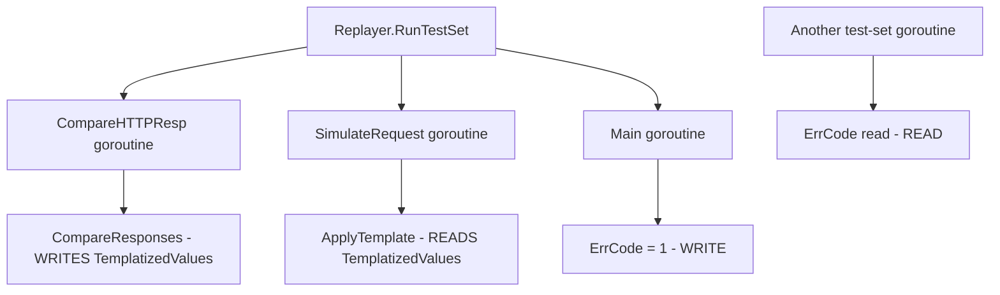

# ISSUE-001: Global Mutable State Creates Race Conditions

## Summary
Package-level mutable maps `TemplatizedValues` and `SecretValues` in `utils/utils.go` and the package-level `ErrCode` int are read and written from multiple goroutines without any synchronization. During replay, `CompareResponses` mutates `TemplatizedValues` in the matcher while other goroutines may read from it for template substitution.

## Technical Explanation

### Data Flow


### Execution Flow
1. `Replayer.Start()` iterates over test-sets
2. `RunTestSet()` launches goroutines via `errgroup` for request simulation and response comparison
3. `CompareHTTPResp` → `CompareResponses` → `compareZip` → `assignFromActual` mutates `utils.TemplatizedValues[k] = *act`
4. Concurrently, template application reads from `utils.TemplatizedValues`
5. In `--keep-app-alive` mode, multiple test-sets may overlap execution

### Failure Flow
- Go's `map` type is **not safe for concurrent use**
- Concurrent read+write on a map causes `fatal error: concurrent map read and map write` (unrecoverable, not caught by `recover()`)
- Even without the fatal error, data races produce non-deterministic template substitution

## Root Cause
These global variables were introduced early in the project before the adoption of `errgroup`-based concurrency. The codebase evolved to use concurrent goroutines for test execution, but the shared state was never migrated to thread-safe storage.

## Fix Strategy

### Minimal Fix
Wrap access with `sync.RWMutex`:
```go
var (
    templateMu        sync.RWMutex
    TemplatizedValues  = map[string]interface{}{}
    secretMu          sync.RWMutex
    SecretValues       = map[string]interface{}{}
)

func SetTemplateValue(key string, value interface{}) {
    templateMu.Lock()
    TemplatizedValues[key] = value
    templateMu.Unlock()
}

func GetTemplateValue(key string) (interface{}, bool) {
    templateMu.RLock()
    v, ok := TemplatizedValues[key]
    templateMu.RUnlock()
    return v, ok
}
```

For `ErrCode`:
```go
var errCode atomic.Int32

func SetErrCode(code int) { errCode.Store(int32(code)) }
func GetErrCode() int     { return int(errCode.Load()) }
```

### Proper Fix
Thread the template map through context or pass as a parameter to `CompareResponses`:
```go
func CompareResponses(response1, response2 *interface{}, key string, templateMap map[string]interface{}) {
    rev := reverseMap(templateMap)
    compareZip(response1, response2, key, rev, templateMap)
}
```

### Enterprise-Grade Fix
Create a `TemplateStore` interface:
```go
type TemplateStore interface {
    Get(key string) (interface{}, bool)
    Set(key string, value interface{})
    Snapshot() map[string]interface{}
    Reset()
}
```
Implement with `sync.RWMutex`-guarded map, inject via constructor into `Replayer` and `Matcher`.

## Code Changes Required

| File | Change |
|---|---|
| `utils/utils.go` | Replace global vars with accessor functions + mutex |
| `pkg/matcher/utils.go` | Update `CompareResponses`, `assignFromActual` to use accessors or accept map param |
| `pkg/service/replay/replay.go` | Thread template store through `RunTestSet` |
| `main.go` | Change `os.Exit(utils.ErrCode)` to `os.Exit(utils.GetErrCode())` |
| `pkg/service/replay/replay.go#L798` | Change `utils.ErrCode = 1` to `utils.SetErrCode(1)` |

## Testing Strategy

### Unit Tests
```go
func TestTemplatizedValuesThreadSafety(t *testing.T) {
    var wg sync.WaitGroup
    for i := 0; i < 100; i++ {
        wg.Add(2)
        go func(n int) {
            defer wg.Done()
            utils.SetTemplateValue(fmt.Sprintf("key-%d", n), n)
        }(i)
        go func(n int) {
            defer wg.Done()
            utils.GetTemplateValue(fmt.Sprintf("key-%d", n))
        }(i)
    }
    wg.Wait()
}
```

### Integration Tests
Run existing e2e tests with `-race` flag enabled.

### Edge Case Tests
- Concurrent writes to same key from different test-sets
- Read during Reset (snapshot + clear)
- Template substitution with empty map

## Risk Assessment
- **Side effects**: All callers of `TemplatizedValues` must be updated. Search for direct map access patterns.
- **Rollback**: Revert the mutex wrapper functions if performance regression detected.

## Validation Checklist
- [ ] Bug reproduced (run with `-race` flag)
- [ ] Fix implemented (mutex or accessor functions)
- [ ] All direct map accesses replaced with accessor calls
- [ ] Tests added (concurrent access test)
- [ ] CI passed with `-race` enabled
- [ ] Manual verification: run `keploy test` with multiple test-sets
