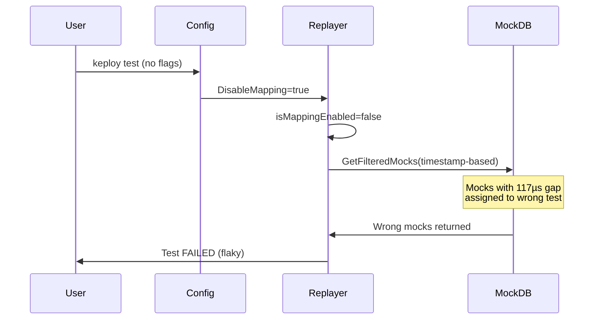

# ISSUE-003: Default `disableMapping: true` Contradicts CLI/Intended Behavior

## Summary
The default config in `config/default.go` sets `disableMapping: true`, which silently disables the mapping-based mock filtering strategy in test mode. This forces all users onto the timestamp-based fallback path, which has known race-window issues with tightly-spaced mocks.

## Technical Explanation

### Data Flow
1. `config.New()` reads `default.go` → `DisableMapping = true`
2. User runs `keploy test` without explicit `--disable-mapping` flag
3. `Replayer.RunTestSet()` calls `r.determineMockingStrategy(ctx, testSetID, isMappingEnabled)`
4. `isMappingEnabled = !r.config.DisableMapping` → `false`
5. Falls back to timestamp-based mock filtering
6. Mocks with timestamps within microseconds of each other may be assigned to wrong test cases

### The Contradiction
The CLI `--disable-mapping` flag at `cmd.go:370` uses `c.cfg.DisableMapping` as its default, which inherits from the config YAML. The comment at lines 361-369 explicitly documents this as problematic:

> "Hardcoding the default to true silently disabled mapping-based mock filtering in test mode even when mappings.yaml was correctly produced during record, forcing replay onto the brittle timestamp-window path that loses tightly-spaced per-test mocks"

### Failure Flow


## Root Cause
The default was set to `true` for backwards compatibility during the transition from timestamp-based to mapping-based filtering. The `determineMockingStrategy` already has a fallback when no `mappings.yaml` exists, so the default `true` provides no additional safety.

## Fix Strategy

### Suggested Patch
```diff
--- a/config/default.go
+++ b/config/default.go
@@ -108,7 +108,7 @@ record:
 configPath: ""
 bypassRules: []
-disableMapping: true
+disableMapping: false
 contract:
```

## Code Changes Required

| File | Change |
|---|---|
| `config/default.go#L111` | Change `disableMapping: true` to `disableMapping: false` |

## Testing Strategy

### Integration Tests
- Record a test-set with tightly-spaced mocks (< 1ms apart)
- Replay with default config → verify mapping-based path is used
- Verify `determineMockingStrategy` falls back correctly when no mappings.yaml exists

## Risk Assessment
- **Low risk**: `determineMockingStrategy` already handles the no-mappings-file case by falling back to timestamp-based filtering
- **Backwards compatibility**: Users who explicitly set `disableMapping: true` in their `keploy.yml` are unaffected

## Validation Checklist
- [ ] Bug reproduced (run test with default config, verify timestamp-based path used)
- [ ] Fix implemented
- [ ] CI passed
- [ ] Manual verification: test-set with mappings uses mapping-based filtering by default
