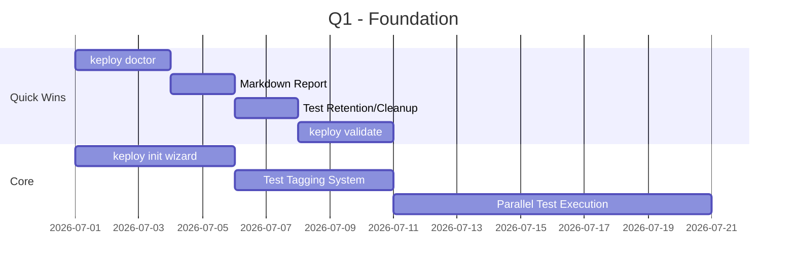
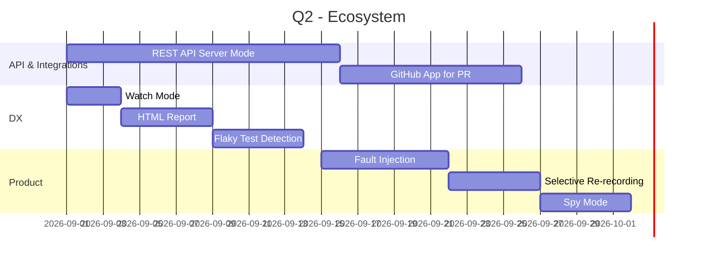
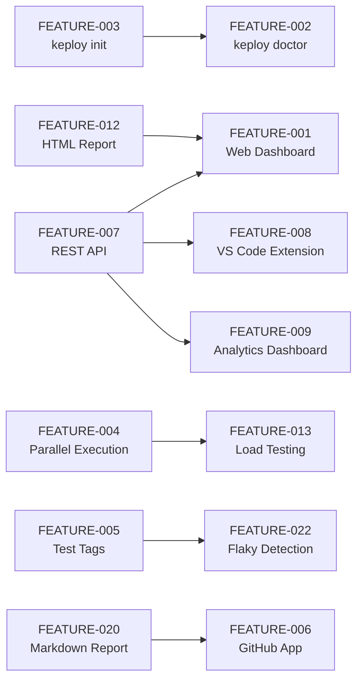

# FEATURE_ROADMAP.md — Prioritized Feature Roadmap

## Priority Matrix

| Feature ID | Feature Name | Impact | Effort | Priority | Quarter |
|-----------|-------------|--------|--------|----------|---------|
| FEATURE-003 | `keploy init` — Interactive Setup Wizard | 9/10 | 3-5 days | **P0** | Q1 |
| FEATURE-002 | `keploy doctor` — Environment Diagnostics | 8/10 | 2-3 days | **P0** | Q1 |
| FEATURE-004 | Parallel Test Set Execution | 9/10 | 1-2 weeks | **P0** | Q1 |
| FEATURE-020 | Markdown Report for PR Comments | 7/10 | 1-2 days | **P0** | Q1 |
| FEATURE-005 | Test Tagging & Filtering System | 8/10 | 3-5 days | **P0** | Q1 |
| FEATURE-017 | Test Retention Policies & Cleanup | 6/10 | 1-2 days | **P0** | Q1 |
| FEATURE-016 | `keploy validate` — Schema Validation | 6/10 | 2-3 days | **P0** | Q1 |
| FEATURE-006 | GitHub App for PR Test Comments | 9/10 | 1-2 weeks | **P1** | Q2 |
| FEATURE-007 | REST API Server Mode | 10/10 | 2-3 weeks | **P1** | Q2 |
| FEATURE-012 | HTML Test Report Generation | 7/10 | 3-5 days | **P1** | Q2 |
| FEATURE-022 | Flaky Test Detection & Quarantine | 8/10 | 3-5 days | **P1** | Q2 |
| FEATURE-011 | Watch Mode (`keploy test --watch`) | 7/10 | 2-3 days | **P1** | Q2 |
| FEATURE-010 | Fault Injection During Replay | 7/10 | 1 week | **P1** | Q2 |
| FEATURE-019 | Selective Re-recording of Individual Tests | 7/10 | 3-5 days | **P1** | Q2 |
| FEATURE-009 | Test Analytics & Trend Dashboard | 8/10 | 1-2 weeks | **P1** | Q2 |
| FEATURE-021 | Spy Mode (Selective Mocking) | 7/10 | 3-5 days | **P1** | Q2 |
| FEATURE-014 | Webhook/Notification System | 7/10 | 3-5 days | **P2** | Q3 |
| FEATURE-015 | Test Data Masking & Synthetic Data | 8/10 | 1-2 weeks | **P2** | Q3 |
| FEATURE-018 | OpenTelemetry Integration | 7/10 | 1 week | **P2** | Q3 |
| FEATURE-023 | `keploy compare` — Live Traffic Comparison | 7/10 | 1 week | **P2** | Q3 |
| FEATURE-024 | SARIF Report Output | 5/10 | 2-3 days | **P2** | Q3 |
| FEATURE-025 | Replay.go Modular Decomposition | 8/10 | 2-3 weeks | **P2** | Q3 |
| FEATURE-001 | Web Dashboard for Test Results | 10/10 | 3-4 weeks | **P2** | Q3-Q4 |
| FEATURE-013 | Load Testing from Recorded Traffic | 8/10 | 2-3 weeks | **P3** | Q4 |
| FEATURE-008 | VS Code Extension | 8/10 | 3-4 weeks | **P3** | Q4 |

---

## Quarterly Execution Plan

### Q1: Foundation & Developer Onboarding (6-8 weeks)
> **Theme:** Make Keploy instantly usable and faster

**Expected outcomes:**
- Time-to-first-test drops from ~1 hour to ~5 minutes
- CI pipeline speed improves 3-5x
- "Is my environment set up correctly?" question answered instantly
- Test organization matches real-world usage patterns

### Q2: Ecosystem & Integration (6-8 weeks)
> **Theme:** Make Keploy a first-class citizen in CI/CD and IDEs

**Expected outcomes:**
- External tools can interact with Keploy programmatically
- PR-level test visibility without parsing logs
- Inner development loop tightened with watch mode
- Resilience testing capability (fault injection)

### Q3: Enterprise & Observability (6-8 weeks)
> **Theme:** Enterprise readiness and production-grade observability

**Focus areas:**
- Webhook/notification system for team workflows
- PII masking and synthetic data for regulated industries
- OpenTelemetry integration for test-to-trace correlation
- Live traffic comparison for canary deployments
- SARIF output for security compliance pipelines
- Architecture cleanup (replay.go decomposition)

### Q4: Differentiation & Vision (6-8 weeks)
> **Theme:** Unique capabilities that no competitor offers

**Focus areas:**
- Web Dashboard (requires Q2's REST API)
- Load testing from recorded traffic
- VS Code extension (requires Q2's REST API)
- AI-powered test generation improvements

---

## Priority Definitions

| Priority | Definition | Criteria |
|----------|-----------|----------|
| **P0 — Must Have** | Critical for adoption and usability. Blocking user onboarding or CI integration. | Impact ≥ 6, Effort ≤ 2 weeks, addresses a gap that causes user churn |
| **P1 — High Value** | Significant competitive advantage or ecosystem integration. Enables new workflows. | Impact ≥ 7, builds on P0 foundation, competitive pressure |
| **P2 — Nice to Have** | Enterprise features, observability, or architecture improvements. Important but not urgent. | Impact ≥ 5, may require P0/P1 prerequisites |
| **P3 — Future** | Visionary features requiring substantial infrastructure or UX investment. | Impact ≥ 8 potential, effort ≥ 3 weeks, requires ecosystem prerequisites |

---

## Dependencies Graph

## ROI Analysis

| Feature | Dev Days | Users Impacted | ROI Score |
|---------|---------|---------------|-----------|
| FEATURE-003 `keploy init` | 4 | Every new user | ⭐⭐⭐⭐⭐ |
| FEATURE-002 `keploy doctor` | 2 | Every new user | ⭐⭐⭐⭐⭐ |
| FEATURE-020 Markdown Report | 1.5 | Every CI user | ⭐⭐⭐⭐⭐ |
| FEATURE-017 Retention Policies | 1.5 | Every CI user | ⭐⭐⭐⭐ |
| FEATURE-004 Parallel Execution | 8 | Enterprise users | ⭐⭐⭐⭐ |
| FEATURE-005 Test Tags | 4 | Power users | ⭐⭐⭐⭐ |
| FEATURE-006 GitHub App | 8 | Every CI user | ⭐⭐⭐⭐ |
| FEATURE-007 REST API | 15 | Ecosystem | ⭐⭐⭐⭐ |
